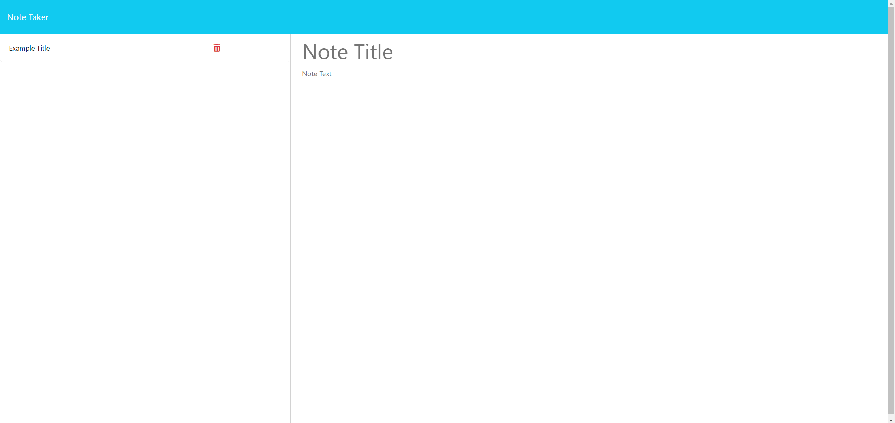

# Note-Taker  

## Description

This program allows you to take and save notes!

## Table of Contents

- [Installation](#installation)
- [Usage](#usage)
- [Screen-Shot](#screen-shot)
- [License](#license)
- [Contributing](#contributing)
- [Questions](#questions)

## Installation

 If you intend to gitclone this repositor, be sure to run ```npm i``` in your integrated terminal.

## Usage

 1. [Website Link](https://notetaker-ch-11-bee10ebdef6d.herokuapp.com/)
 2. Enter a title and a note.
 3. You can save and delete notes.

## Screen-Shot



## License

This project is licensed under the MIT License. See the [MIT License](https://github.com/charleswt/Professional-README-Generator/blob/main/LICENSE) file for details.

## Contributing

This project was developed by [Charles Tiffany](https://github.com/charleswt/).

## Questions

If you have any questions or suggestions, please email me at charleswtiffany@gmail.com.